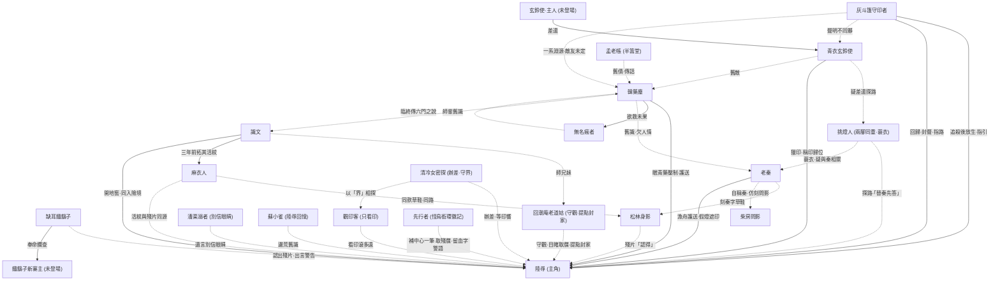
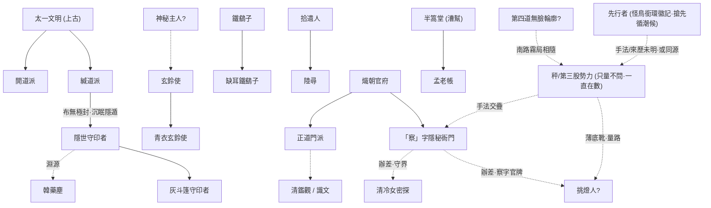
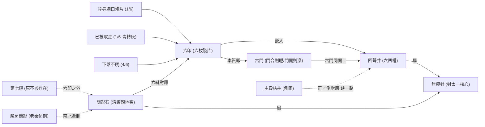

<!-- source: 索引/人物關係圖.md@f2b6883d30c7 · entry: _derived/manifest.json -->

# 人物關係圖

> [!note] 檢視方式
> 需啟用 Obsidian 內建 **Mermaid**（預設支援）。下方為劇情關係與勢力歸屬;點節點文字旁的 wiki 連結可跳頁。

## 一、人物關係網

## 二、勢力歸屬與世界觀源流

## 三、六印 / 六門 / 回聲井 關係

## 相關
- [資料圖譜](../索引/資料圖譜.md) · [時間線](../索引/時間線.md) · 世界觀
