<!-- source: 索引/時間線.md@d4aa6ce0674b · entry: _derived/manifest.json -->

# 時間線

## 遠古背景
- **上古**：[太一](../勢力/太一.md)文明修至近神格,晚期分裂[開道派](../勢力/太一.md#%E9%96%8B%E9%81%93%E6%B4%BE)／[緘道派](../勢力/太一.md#%E7%B7%98%E9%81%93%E6%B4%BE)。
- **絕道之戰**：太一自我毀滅,殘篇散落[邊荒](../地點/邊荒.md)成[道紋](../設定/道紋.md)之源。
- **戰爭尾聲**：緘道派殘存者布[無極封](../設定/無極封.md)、封[太一遺構](../設定/太一遺構.md)核心,沉眠隱遁為[隱世守印者](../勢力/隱世守印者.md)。

## 故事前史（相對「當下」）
- **三年前**：[麻衣人](../人物/麻衣人.md)至[清鑑觀](../地點/清鑑觀.md),令[識文](../人物/識文.md)拓其活紋三夜,抄畢言「別讓答案先看見問題」;隨後瘋去引發「紋在叫」慘案,道士自相殘殺死七人。麻衣人失蹤,[清鑑觀地窖](../地點/清鑑觀地窖.md)封三年(師父貼三道符「三年一鬆」)。
- **三年前春末**：「[自稱秦](../人物/老秦.md)」的老舟子送[識文短香](../設定/識文短香.md)三匣「舊人所託」。
- **三年前秋初**（[麻衣人](../人物/麻衣人.md)走後十餘日）：老秦夜借[後山柴房](../地點/後山柴房.md)「囑勿點灶」,疑於灶下仿刻第二座[問影](../設定/問影石.md)。更早的舊志只記「山下新來一舟人,自稱秦,不問俗名」。
- **三年前**：[韓藥塵](../人物/韓藥塵.md)挖[渡風口藥鋪](../地點/渡風口藥鋪.md)暗道,意外挖通[太一遺構](../設定/太一遺構.md)邊緣。
- **三個月前**：[回聲井](../地點/回聲井.md)一枚[印](../設定/六印.md)被不明者取走;[裂谷](../地點/裂谷.md)七名[拾遺人](../勢力/拾遺人.md)乾屍而死。
- **三個月前**：韓藥塵受託赴裂谷傳話「六印缺一,井聲將返」,欲救[無名瘋者](../人物/無名瘋者.md)未果、得知[六門](../設定/六門.md)之說,並留下[小臂舊疤](../設定/韓藥塵舊疤.md);歸來後性情大變、閉門謝客。

## 故事正線（依章節）

```mermaid
timeline
    title 主線行程
    第1章 : 裂谷拾殘片·守印者追殺
    第2章 : 黑齒暗河·誤開回聲井之門
    第3章 : 回聲井醒來·守印者指引往渡風口
    第4章 : 渡風口·尋得韓藥塵
    第5章 : 眠青藥壓印·玄鈴使夜襲·走暗道
    第6章 : 漕渠·六印共振·涉水脫身
    第7章 : 漁舟江行·得知六門之說
    第8章 : 蘆灣·青鱗燈追蹤·假燈誘開
    第9章 : 漕渠舊道石室·殘印首度自醒
    第10章 : 決意北上清鑑觀·走鐵鷂子近路
    第11章 : 闖鐵鷂渡·缺耳者警告
    第12章 : 磨牙灘棄舟·霧嶺·兩光呼應
    第13章 : 抵清鑑觀·識文·殘片與麻衣人拓本同源
    第14章 : 鐘下地窖·麻衣人始末·青鱗燈追至
    第15章 : 開三道鎖·下探地窖·巨石等待
    第16章 : 問影石六縫·少一印·老秦獨擋玄鈴使
    第17章 : 影壁·玄鈴使餵石·第七縫現·老秦以短香拒敵
    第18章 : 灰斗篷守印者回歸·指認第七縫
    第19章 : 逆鈴·灰斗篷封聲留守·眾走觀後裂道
    第20章 : 骨灰路·刻秦字草鞋·松林身影
    第21章 : 草鞋之謎·殘片認得·兩腳同重的新跟蹤者
    第22章 : 後山柴房·挑燈人探路·灶下聽鈴
    第23章 : 灶底窄口·仿刻問字·殘片畏縮
    第24章 : 兩座問影牽制·追問老秦是什麼人
    第25章 : 藏經閣舊卷·自稱秦·灰布指路
    第26章 : 地板三響·夾層薄銅·有人替秦先答了
    第27章 : 有人先答·識文坦言主殿枯井
    第28章 : 井底倒圖·先問井·拒合圖·井口有人
    第29章 : 井問無聲·問井者勿問人·六問·拒答
    第30章 : 繡痕·察字官牌·朝廷隱秘衙門介入
    第31-32章 : 下山避官道·眼形記號·半月前先行者
    第33-35章 : 漕渠溺者「別信眼睛」·假眼·空舟南下
    第36-39章 : 南下三河埠·半篙堂舊債·三年前那場雨·傘已先撐開
    第40-44章 : 鹽市殘燈傘·鹽聽耳室·清冷女密探與觀印客·淡門
    第45-48章 : 廢碼頭掌印·聽篙船·江心耳·江底是會走路的聲音
    第49-51章 : 岸邊灶·秤記號現·古石柱(不准人問)
    第52-57章 : 白葦渡吃音·渡江·眠燈鎮·殘印被秤
    第58-60章 : 南路秤影·壓平泥面·岔路立錢·選南路
    第61-66章 : 霧門黑石秤盤·第三印·低橋已過者輕·竹杖漏灰指路
    第67-72章 : 灰門交影·窄門同足·問路不問人·少了一步的地方
    第73-75章 : 霜鏡石室·嵌骨籌·第四道輪廓·以「一起」化解
    第76-80章 : 窄刃路·懸門·照殿三影·第二問·按「道」印破局
    第81-84章 : 地底石城·望歸亭·候燈者三燈之約
    第85-89章 : 出山·柴門問路·枯木鈴·官差盤關·採石徑黃光
    第90-95章 : 清河鎮·廢染坊枯井秤軸·三線並起·西碼頭老秦遺痕
    第96-100章 : 江上煙·聽潮礬場黑燈過秤·奪鐵桶·三線印記缺一筆·蘆汀別舍(第100章)
    第101章 : 照影灘·斷柱補「中心一筆」·怪鳥徽記·銀絲殘陣自毀
    第102章 : 上回潮庵·老道姑·石庫殘牒被先行者取走
    第103章 : 潮紋夜動·潮候簡記·三列七記留門·古井「枝開九轉」舊刻
    第104章 : 退潮下九轉石穴·樞紐被拔·血字「莫追九轉,潮盡人亡」
    第105章 : 潮退之後·梳理全局·謄本留底·辭回潮庵順海岸南下
    第106章 : 礁灣第七活結脫險·兩腳同重靴印·抵落汐封家·青銅潮心先至
    第107章 : 封家工坊扣合潮心·水脈兩聲同響·海圖指怒潮碥·連夜乘舟入海
```

## 關鍵倒數
- **眠青藥三日大限**（[第九章](../chapters/ch09_agy.md)起）：三日內[殘印將醒透](../設定/殘印自醒.md),届時持[鈴](../設定/玄鈴.md)者皆能感應[陸尋](../人物/陸尋.md)位置。

## 相關
- [資料圖譜](../索引/資料圖譜.md) · [人物關係圖](../索引/人物關係圖.md)
